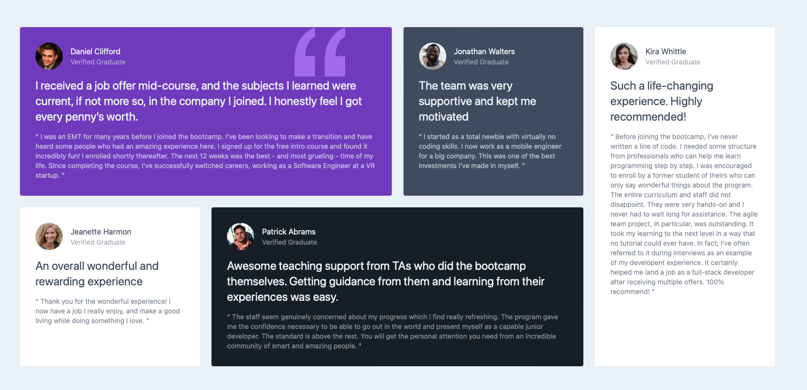

# Frontend Mentor - Testimonials grid section solution

This is a solution to the [Testimonials grid section challenge on Frontend Mentor](https://www.frontendmentor.io/challenges/testimonials-grid-section-Nnw6J7Un7). Frontend Mentor challenges help you improve your coding skills by building realistic projects. 

## Table of contents

- [Overview](#overview)
  - [The challenge](#the-challenge)
  - [Screenshot](#screenshot)
  - [Links](#links)
- [My process](#my-process)
  - [Built with](#built-with)
  - [What I learned](#what-i-learned)
  - [Continued development](#continued-development)
  - [Useful resources](#useful-resources)
- [Author](#author)
- [Acknowledgments](#acknowledgments)

### Screenshot

### Links

- Solution URL: [Solution](https://github.com/ZohirB-dev/Testimonial-Grid.git)
- Live Site URL: [Live Site](https://zohirb-dev.github.io/Testimonial-Grid/)

## My process

### Built with

- Semantic HTML5 markup
- Tailwind CSS
- CSS Grid
- Mobile-first workflow

## Author

- Frontend Mentor - [@zohirb-dev](https://www.frontendmentor.io/profile/zohirb-dev)

